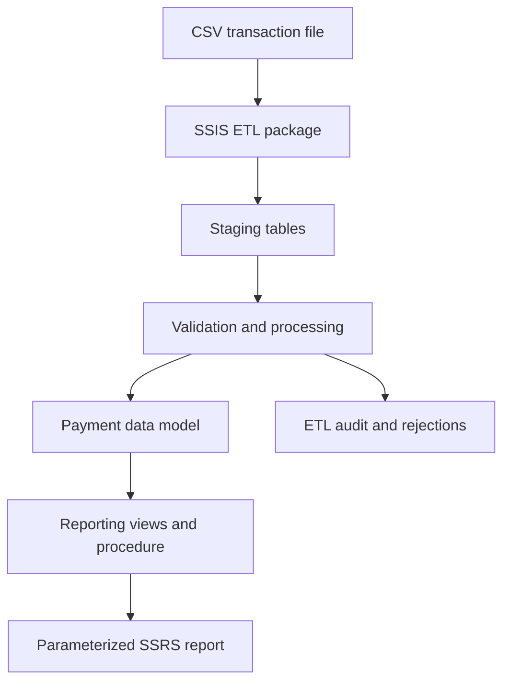

# PaymentFlow

PaymentFlow is an end-to-end portfolio project that simulates the ingestion,
validation, processing, auditing and reporting of payment transactions.

The project demonstrates a complete data flow from a generated CSV file to a
parameterized SSRS report, including repeatable large-volume and performance
tests.

## Architecture



## Technology stack

- Microsoft SQL Server 2022
- T-SQL
- SQL Server Integration Services (SSIS)
- SQL Server Reporting Services (SSRS)
- Python
- Visual Studio and SQL Server Data Tools
- Git

## Implemented functionality

### Transaction generation

- deterministic Python generator controlled by row count and random seed
- CSV input compatible with the SSIS package
- support for sample, 100,000-row and 1,000,000-row datasets

### ETL process

`LoadPaymentTransactions.dtsx`:

1. Creates an ETL execution record.
2. Loads the CSV file into a staging table.
3. Validates and processes staged transactions.
4. Inserts valid rows into the payment model.
5. Records read, inserted and rejected row counts.
6. Records failures through an `OnError` event handler.

### Data quality and audit

- staging states: `PENDING`, `IMPORTED` and `REJECTED`
- duplicate detection using the external transaction identifier
- duplicate rejection code `ALREADY_IMPORTED`
- idempotent processing of previously imported files
- ETL execution status, duration, counters and error tracking
- transaction status history

### Reporting layer

The reporting layer contains:

- `reporting.vw_TransactionDetails`
- `reporting.vw_DailyTransactionSummary`
- `reporting.usp_GetDailyTransactionSummary`

The report can be filtered by date range, merchant, country and currency.
`PaymentTransactionSummary.rdl` displays daily counts, amounts, transaction
types and statuses.

## Measured large-volume results

The test suite was executed on SQL Server 2022 Developer Edition with a final
dataset of 1,301,000 transactions.

- 1,000,000-row CSV generation: 12.516 s
- 1,000,000-row SSIS import: 38.091 s and 26,252.92 rows/s
- final data-quality validation: all six checks passed
- duplicate import: all duplicate rows rejected with `ALREADY_IMPORTED`
- database integrity check: completed without reported errors
- reporting indexes and execution plans: measured before and after changes
- rejected index experiment: documented rather than hidden
- index fragmentation: reduced from 98.74% to 0.13% by targeted maintenance

Detailed environment data, timings, execution-plan observations, limitations
and conclusions are available in
[`tests/performance/results-2026-09-08.md`](tests/performance/results-2026-09-08.md).
The reproducible procedure is documented in
[`tests/performance/README.md`](tests/performance/README.md).

## Screenshots

### SSIS ETL execution


### SSRS payment transaction summary


## Repository structure

```text
database/
  migrations/       Database schema and index migrations
  procedures/       Stored procedures
  views/            Reporting views
  maintenance/      Explicit database maintenance scripts

generator/           Synthetic payment transaction generator

ssis/
  PaymentFlow.ETL/   SSIS project and ETL package

ssrs/
  PaymentFlow.Reports/  SSRS project and parameterized report

tests/
  performance/      Reproducible volume, latency and integrity tests
```

## Running the project

1. Create the `PaymentFlow` database in SQL Server.
2. Execute the database scripts in their intended order.
3. Generate or provide a transaction CSV file.
4. Configure the SQL Server and CSV connection managers in the SSIS project.
5. Set the `SourceFileName` package variable to the selected CSV filename.
6. Run `LoadPaymentTransactions.dtsx`.
7. Verify the execution in the audit tables.
8. Configure the `DS_PaymentFlow` shared data source in the SSRS project.
9. Preview `PaymentTransactionSummary.rdl`.

## Potential extensions

- automated ETL scheduling and deployment to the SSIS catalog
- deployment to a Report Server
- CI-based database and ETL tests
- concurrent-load and cold-cache performance tests
- automatic derivation of `SourceFileName` from the configured CSV path
