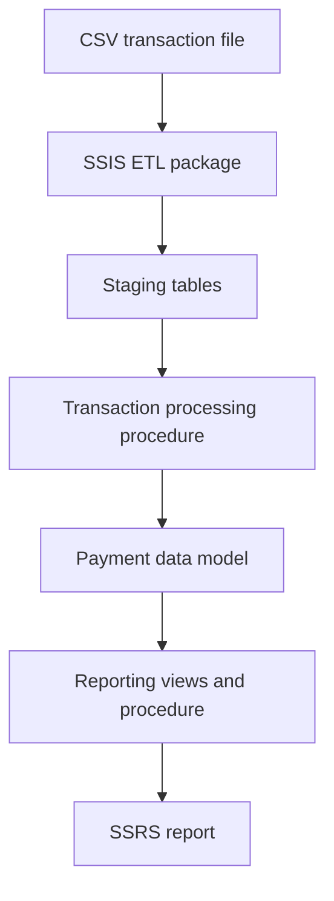
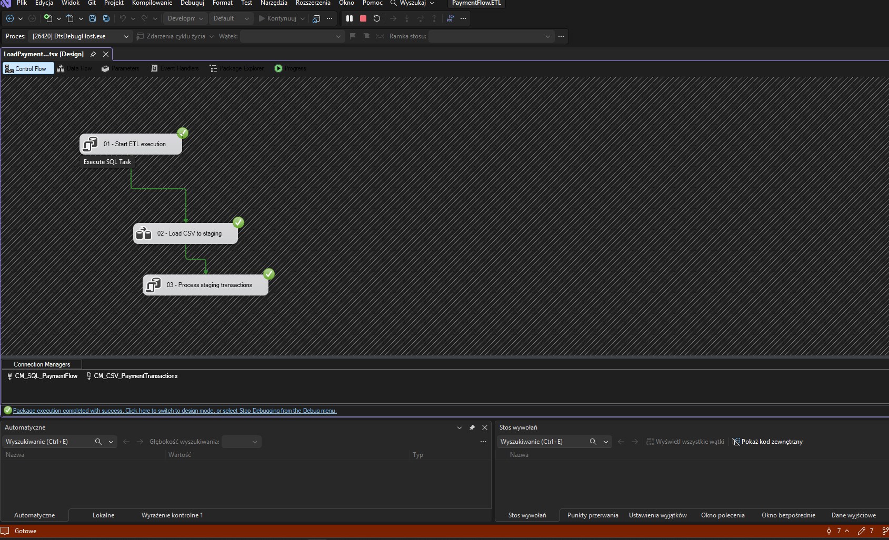
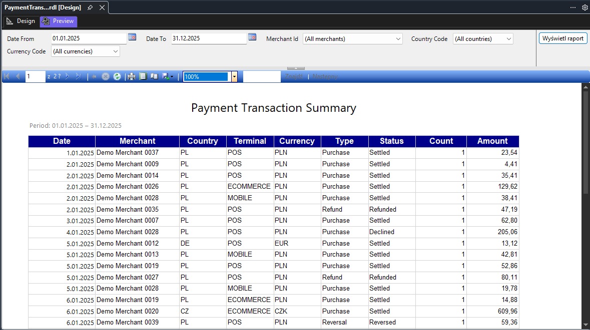

# PaymentFlow


PaymentFlow is an end-to-end portfolio project simulating the ingestion, validation, processing and reporting of payment transactions.


The project demonstrates a complete data flow from a generated CSV file to a parameterized SSRS report.


## Architecture





## Technology stack


- Microsoft SQL Server 2022

- T-SQL

- SQL Server Integration Services (SSIS)

- SQL Server Reporting Services (SSRS)

- Python

- Visual Studio and SQL Server Data Tools

- Git


## Implemented functionality


### Transaction data generation


- Python-based generation of sample payment transactions

- CSV input compatible with the SSIS package

- Test dataset containing 1,000 transactions


### ETL process


The `LoadPaymentTransactions.dtsx` package performs the following steps:


1. Creates an ETL execution record.

2. Loads transactions from CSV into the staging table.

3. Validates and processes staged transactions.

4. Inserts valid transactions into the target data model.

5. Records processing statistics and errors.


The package also contains an `OnError` event handler that updates the ETL execution audit after a failure.


### Data quality and audit


- staging statuses: `PENDING`, `IMPORTED` and `REJECTED`

- duplicate transaction detection

- duplicate records marked with `ALREADY_IMPORTED`

- idempotent processing of previously imported files

- execution status tracking

- counters for read, inserted and rejected rows

- error message recording


### Reporting layer


The reporting layer contains:


- `reporting.vw_TransactionDetails`

- `reporting.vw_DailyTransactionSummary`

- `reporting.usp_GetDailyTransactionSummary`


The stored procedure supports filtering by:


| Parameter | Description |

|---|---|

| `DateFrom` | Start of the reporting period |

| `DateTo` | End of the reporting period |

| `MerchantId` | Merchant or all merchants |

| `CountryCode` | Country or all countries |

| `CurrencyCode` | Currency or all currencies |


### SSRS report


`PaymentTransactionSummary.rdl` provides:


- date range filtering

- merchant selection

- country selection

- currency selection

- daily transaction counts

- transaction amounts

- transaction type and status information

- formatted dates and numeric values


## Performance testing

A reproducible large-volume test suite is available in
[`tests/performance`](tests/performance/README.md). It covers 100,000-row
and 1,000,000-row ETL runs, idempotency, data validation, reporting
latency, logical reads, execution plans and a baseline-versus-indexed
comparison.

Measured results are recorded only after running the suite on a documented
SQL Server environment.

## Screenshots

### SSIS ETL execution



### SSRS payment transaction summary




## Validation results


| Test | Result |

|---|---|

| Initial CSV import | 1,000 rows read and 1,000 rows inserted |

| Repeated import of the same file | 0 rows inserted and 1,000 rows rejected |

| Duplicate rejection reason | `ALREADY_IMPORTED` |

| Reporting transaction total | 1,000 transactions |

| SSRS parameter filtering | Completed successfully |


## Repository structure


```text

database/

  procedures/       Stored procedures

  views/            Reporting views


ssis/

  PaymentFlow.ETL/  SSIS project and ETL package


ssrs/

  PaymentFlow.Reports/  SSRS project and transaction report

```


## Running the project


1. Create the `PaymentFlow` database in SQL Server.

2. Execute the database scripts in their intended order.

3. Generate or provide the transaction CSV file.

4. Configure the SQL Server and CSV connection managers in the SSIS project.

5. Run `LoadPaymentTransactions.dtsx`.

6. Verify the execution results in the audit tables.

7. Open the SSRS project.

8. Configure the `DS_PaymentFlow` shared data source.

9. Preview `PaymentTransactionSummary.rdl`.


## Planned improvements


- publish measured large-volume benchmark results

- refine indexing based on captured execution plans

- automated ETL scheduling

- deployment to the SSIS catalog

- deployment to a Report Server

- automated database and ETL tests


